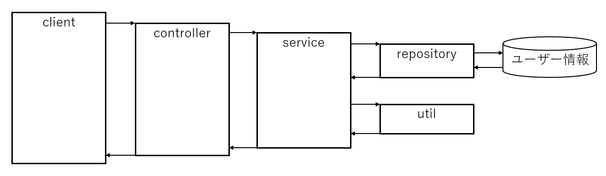
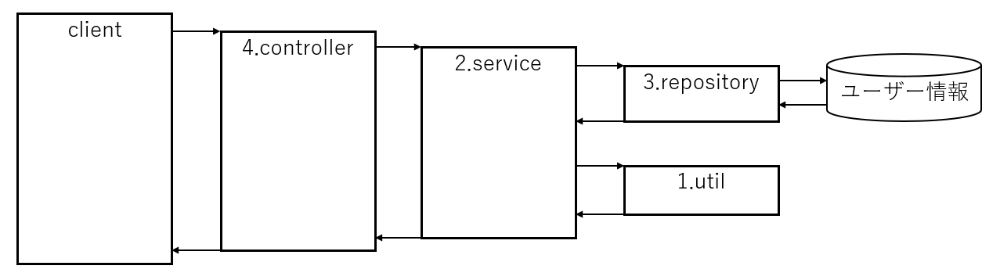
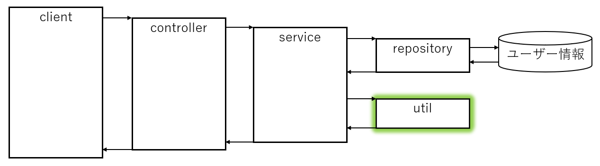
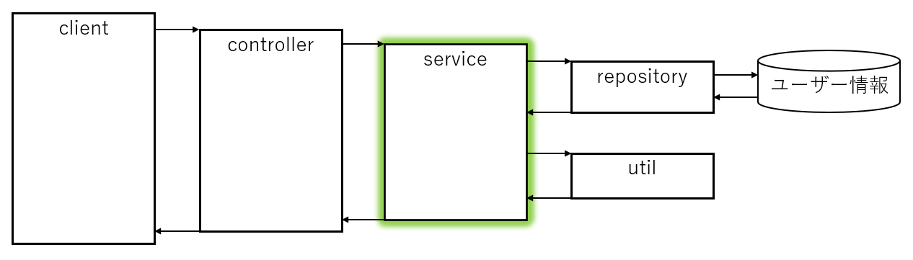
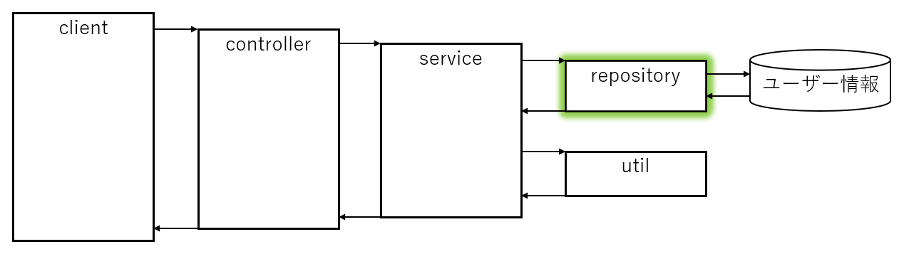
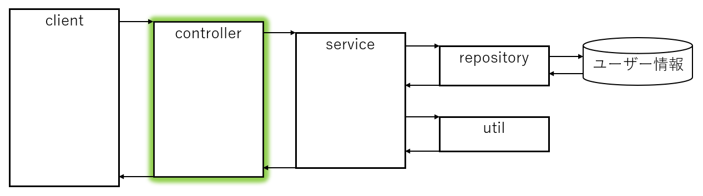

# Spring Boot テスト実践入門

## 概要

Java / Spring Boot のテストの基本を学ぶ勉強会です。テストの重要性、テストレベル、テストライブラリ（JUnit 5 / Mockito / MockMvc）について、実装方法、実践パターンを扱います。

## 対象読者

- Java / Spring Boot でアプリケーションを開発しているが、テストを「なんとなく」書いている方
- テストレベルやテストライブラリの使い分けを整理したい方
- 「テスト環境は整えたからテスト書いて」と言われたときに、独力でテスト実装ができるようになりたい方

## 事前準備と到達目標

Controller / Service の役割とコンストラクタ DI を理解している方が対象です。
Java 21、Maven Wrapper を使い、Spring Boot 4.0 系のプロジェクトで進めます。
[Spring Initializr](https://start.spring.io/) で Maven / Java / Jar / YAML を選び、新しいプロジェクトを作成してください。
依存関係に Spring Web、Lombok、H2 Database、MyBatis Framework を用意してください。
MyBatis は SQL の実行結果を Java オブジェクトに対応付けるライブラリです。
4.0 系に対応する MyBatis Starter を使い、テスト用にも同じバージョンの Starter を指定します。

`pom.xml` の `dependencies` に、次のテスト用依存関係があることを確認します。

```xml
<dependency>
  <groupId>org.springframework.boot</groupId>
  <artifactId>spring-boot-starter-webmvc-test</artifactId>
  <scope>test</scope>
</dependency>
<dependency>
  <groupId>org.mybatis.spring.boot</groupId>
  <artifactId>mybatis-spring-boot-starter-test</artifactId>
  <version>4.0.0</version>
  <scope>test</scope>
</dependency>
```

メインの MyBatis Starter も、この例では 4.0.0 に合わせます。
[MyBatis Starter の公式資料](https://mybatis.org/spring-boot-starter/mybatis-spring-boot-autoconfigure/) で対応バージョンを確認できます。
パッケージ名は `dev.mikoto2000.springboot.workshop` にします。
実装は `src/main/java`、テストは `src/test/java` に、package 宣言と対応するディレクトリを作って配置します。
本文の断片例は概念の説明用です。ハンズオンでは package とクラス宣言を含むコードを配置してください。

完了時には、普通の Java のテスト、モックを使うテスト、DB / Web の部分テストを実行して違いを説明できることを目指します。

## この資料の構成

この資料は 2 部構成 になっています。

1. 触って学ぶテスト: サンプルアプリを実際に作りながら、Util / Service / Repository / Controller のテストを実装していくハンズオン
2. 座学で学ぶテスト: テストの基本概念、テストレベル、JUnit 5 / Mockito / MockMvc、テスト設計などの理論を整理する座学

「触って学ぶ」で実装した内容を、「座学で学ぶ」で概念として整理し、復習する流れです。対応関係は次の表の通りです。

| 触って学ぶ（ハンズオン） | 座学で学ぶ（理論） |
|---|---|
| [Util のテスト](#util-のテスト普通の-java-のテスト) | [テストの基本概念、良いテストとは何か](#テストの基本概念と重要性) |
| [Service のテスト](#service-のテスト) | [テストレベル（単体・統合・E2E）](#テストレベル単体統合e2e) |
| [Repository のテスト](#repository-のテスト) | [テストレベル（実物の DB との接続）](#テストレベル単体統合e2e) |
| [Controller のテスト](#controller-のテスト) | [MockMvc（Web テスト）](#mockmvcweb-テスト) |
| [Service のテスト](#service-のテスト) | [Mockito（モックの基本）](#mockitoモックの基本) |
| —（ハンズオンでは扱わない） | [テスト設計](#テスト設計) |

## さわって学ぶテスト

### テストの重要性

ハンズオンを始める前に、この機能を使う目的を確認しましょう。テストは、選んだ条件で期待する動作を確認する手段です。変更で壊れた機能を検知する手がかりになります。

このハンズオンでは、Util / Service / Repository / Controller のテストを実際に実装しながら、「テストを書く」ことの価値を体感していきます。テストの目的の詳細（回帰防止、仕様の明確化、設計の改善、品質保証）は、後半の「座学で学ぶテスト」で整理します。

### テストレベルの軽い導入

テストには、テスト対象の大きさを表す「テストレベル」があります。レベルを意識することで、何を、どの範囲で、どの速さでテストするかを整理できます。

| レベル | 対象 | 特徴 |
|---|---|---|
| 単体テスト | 1 つのクラス・メソッド | 高速、依存は必要に応じてモックで置き換える |
| 統合テスト | 複数クラス・DB など | 実物の依存と接続して検証 |
| E2E テスト | システム全体 | 実際のリクエストで検証、低速 |

このハンズオンでは、単体テスト（Util / Service）と、Spring の一部を起動する結合テスト（Repository / Controller）を扱います。この資料では結合テストも広い意味で「統合テスト」と呼びます。詳細なレベルについては、後半の「座学で学ぶテスト」で改めて整理します。

### 題材とするエンドポイント

ユーザーの年齢を取得するエンドポイントに対してテストを作っていきます。

- テーブル「ユーザー情報」に「誕生日」が格納されている
- エンドポイントはユーザー ID を受け取り、そのユーザーの年齢を数値で返却する



### テストを作る範囲

1. Util のテスト(普通の Java のテスト)
2. Service のテスト
3. Repositoryのテスト
4. Controller のテスト



### 共通で使うクラス

後のコードで参照するユーザー情報と日付取得クラスを先に作成します。

```java title="bean/User.java"
package dev.mikoto2000.springboot.workshop.bean;

import java.time.LocalDate;
import lombok.AllArgsConstructor;
import lombok.Data;
import lombok.NoArgsConstructor;

@Data
@AllArgsConstructor
@NoArgsConstructor
public class User {
  private Long id;
  private String name;
  private LocalDate birthday;
}
```

```java title="util/DateTimeUtil.java"
package dev.mikoto2000.springboot.workshop.util;

import java.time.LocalDate;
import org.springframework.stereotype.Component;

@Component
public class DateTimeUtil {
  public LocalDate now() {
    return LocalDate.now();
  }
}
```

## Util のテスト（普通の Java のテスト）

入力に対して一意に出力が決まるメソッドのテストを実装します。
Spring Boot 関係なく、ただの Java の単体テストと同じ考え方でOK。



### 実装

```java
package dev.mikoto2000.springboot.workshop.util;

import java.time.LocalDate;
import java.time.Period;

/**
 * ユーザーに関する諸々の処理を詰め込んだ Util クラス。
 *
 * 本来なら User クラスに含めるべき。
 */
public class UserUtil {

  /**
   * 年齢を取得する。
   *
   * 引数 targetDate で指定した日付に、誕生日 birthday の人が何歳であるかを返却する。
   *
   * @param birthday 誕生日
   * @param targetDate 計算の基準日
   */
  public static Integer getAge(LocalDate birthday, LocalDate targetDate) {
    if (birthday == null) {
      throw new IllegalArgumentException("birthday に値を設定してください");
    }

    if (targetDate == null) {
      throw new IllegalArgumentException("targetDate に値を設定してください");
    }

    return Period.between(birthday, targetDate).getYears();
  }
}
```

### テスト

```java
package dev.mikoto2000.springboot.workshop.util;

import static org.junit.jupiter.api.Assertions.*;

import java.time.LocalDate;
import org.junit.jupiter.api.Test;

/**
 * UserUtilTest
 */
public class UserUtilTest {
  @Test
  public void 誕生日ちょうど() {
    // テスト対象に渡す引数を準備
    LocalDate birthday = LocalDate.of(2000, 1, 1);
    LocalDate targetDate = LocalDate.of(2025, 1, 1);

    // 期待値(expect) と実際の値(actual)を求める
    Integer expect = 25;
    Integer actual = UserUtil.getAge(birthday, targetDate);

    // 期待する値と実際の値を比較
    assertEquals(expect, actual);
  }

  // TODO: 誕生日直前・直後を実装

  @Test
  public void birthdayがnullで例外が発生する() {
    LocalDate birthday = null;
    LocalDate targetDate = LocalDate.of(2025, 1, 1);

    // 例外のテストは assertThrows を使用する
    // この例の場合、 `UserUtil.getAge` で送出された例外が `e` に代入される
    Exception e = assertThrows(
        IllegalArgumentException.class,
        () -> UserUtil.getAge(birthday, targetDate));

    // 期待する値と実際の値を比較
    assertEquals("birthday に値を設定してください", e.getMessage());
  }

}
```

### 実行と練習

プロジェクトのルートで `./mvnw test -Dtest=UserUtilTest` を実行します。
成功したら誕生日直前・直後と、`targetDate=null` のケースを追加しましょう。
誕生日を 2000-01-01 に固定すると、基準日 2024-12-31 は 24 歳、2025-01-01 と 2025-01-02 は 25 歳です。

## Service のテスト

内部で repository, util のメソッドを呼び出すメソッドを実装します。
こちらも Spring Boot は関係なく、 Mockito の知識だけでテストを行えます。



### 実装

```java
package dev.mikoto2000.springboot.workshop.service;

import org.springframework.stereotype.Service;

import dev.mikoto2000.springboot.workshop.repository.UserMapper;
import dev.mikoto2000.springboot.workshop.util.DateTimeUtil;
import dev.mikoto2000.springboot.workshop.util.UserUtil;
import lombok.RequiredArgsConstructor;

/**
 * UserService
 */
@RequiredArgsConstructor
@Service
public class UserService {

  private final DateTimeUtil dateTimeUtil;

  private final UserMapper userMapper;

  /**
   * 指定した userId のユーザーの年齢を返却する。
   *
   * @param userId ユーザー ID
   * @return ユーザーの年齢
   */
  public Integer getAge(Long userId) {

    // ユーザーの取得
    var userOpt = userMapper.findById(userId);
    if (userOpt.isEmpty()) {
      throw new RuntimeException(String.format("対象ユーザーが見つかりませんでした(userId: %d)", userId));
    }
    var user = userOpt.get();

    // 本日の日付の取得
    // 単体テスト時に楽に DI できるように
    // 直接 LocalDate.now() を使わないようにする
    var today = dateTimeUtil.now();

    // 年齢の計算
    // 本当は User クラスにあるべきだけど
    // 説明の簡単化のため UserUtil クラスに実装している
    var age = UserUtil.getAge(user.getBirthday(), today);

    return age;
  }
}
```

### テスト

```java
package dev.mikoto2000.springboot.workshop.service;

import static org.junit.jupiter.api.Assertions.*;
import static org.mockito.Mockito.*;

import java.time.LocalDate;
import java.util.Optional;

import org.junit.jupiter.api.BeforeEach;
import org.junit.jupiter.api.Test;
import org.junit.jupiter.api.extension.ExtendWith;
import org.mockito.Mock;
import org.mockito.junit.jupiter.MockitoExtension;

import dev.mikoto2000.springboot.workshop.bean.User;
import dev.mikoto2000.springboot.workshop.repository.UserMapper;
import dev.mikoto2000.springboot.workshop.util.DateTimeUtil;

/**
 * UserServiceTest
 */
@ExtendWith(MockitoExtension.class)
public class UserServiceTest {

  @Mock
  // モックする対象
  private DateTimeUtil dateTimeUtil;

  @Mock
  // モックする対象
  private UserMapper mapper;

  // テスト対象
  private UserService service;

  @Test
  public void testGetAge() {
    // 以下 ①, ② でモックの返却値を設定

    // 現在時刻を 2025/1/1 だとする ①
    when(dateTimeUtil.now())
      .thenReturn(LocalDate.of(2025, 1, 1));

    // ユーザー ID 1 のユーザーが 25 歳の場合 ②
    when(mapper.findById(1L))
      .thenReturn(Optional.of(new User(1L, "mikoto2000", LocalDate.of(2000, 1, 1))));

    // メソッドを呼び出して戻り値を確認。
    // ③ の呼び出し時に、 ①, ② で設定したモックが利用される。

    // 実行結果の取得 ③
    Integer actual = service.getAge(1L);

    // 想定と実行結果の比較
    assertEquals(25, actual);
  }

  // テストメソッド実行前に毎回呼ばれる処理
  @BeforeEach
  public void setup() {
    service = new UserService(dateTimeUtil, mapper);
  }

}
```

Service のテストでは Spring を起動せず、`new UserService(...)` に依存の代役を渡します。
`@Mock` は代役を生成し、`when(...).thenReturn(...)` は呼び出されたときの戻り値を決めます。
`MockitoExtension` がテストごとにモックを用意するため、ここでは手動の `reset` は不要です。
`./mvnw test -Dtest=UserServiceTest` で確認し、ユーザー未存在のケースも追加してみましょう。

## Repository のテスト

実際に DB 接続するメソッドのテストを実装します。
今回は本物の DB を使用しテストを行う方法を説明します。



### 実装

```java
package dev.mikoto2000.springboot.workshop.repository;

import java.util.Optional;

import org.apache.ibatis.annotations.Mapper;
import org.apache.ibatis.annotations.Select;

import dev.mikoto2000.springboot.workshop.bean.User;

/**
 * UserMapper
 */
@Mapper
public interface UserMapper {

  /**
   * 対象 userId のユーザーを取得する。
   */
  @Select("""
          select
            *
          from
            "user"
          where
            id = #{userId}
          """)
  Optional<User> findById(Long userId);
}
```

### テスト用 DB の準備

`src/test/resources/schema.sql` にテーブル定義を配置します。
H2 はテスト用のインメモリ DB として使い、以下のデータを SQL で用意します。

```sql title="src/test/resources/schema.sql"
CREATE TABLE "user" (
  id BIGINT PRIMARY KEY,
  name VARCHAR(50),
  birthday DATE
);
```

```sql title="src/test/resources/sql/UserMapperTest-findById.sql"
INSERT INTO "user" (id, name, birthday)
VALUES (1, 'mikoto2000', DATE '2000-01-01');
```

### テスト

```java
package dev.mikoto2000.springboot.workshop.repository;

import static org.junit.jupiter.api.Assertions.*;

import java.time.LocalDate;
import java.util.Optional;

import org.junit.jupiter.api.Test;
import org.mybatis.spring.boot.test.autoconfigure.MybatisTest;
import org.springframework.beans.factory.annotation.Autowired;
import org.springframework.test.context.jdbc.Sql;
import org.springframework.transaction.annotation.Transactional;

import dev.mikoto2000.springboot.workshop.bean.User;

/**
 * UserMapperTest
 */
// MyBatis Starter が提供している MyBatis テスト用のアノテーションを設定
// JPA の場合は @DataJpaTest を使用する
@MybatisTest
public class UserMapperTest {

  @Autowired
  private UserMapper mapper;

  @Test
  // @Sql アノテーションで、テストデータ初期化用 SQL を指定
  // この例の場合、 `resources/sql/UserMapperTest-findById.sql` の SQL が実行される
  @Sql("/sql/UserMapperTest-findById.sql")
  // @Transactional を指定することで、テストメソッド実行後 DB がロールバックされる
  @Transactional
  // あとは基本のテストと同じようにメソッドを呼び出して戻り値を確認すればOK.
  public void testFindById() {
    Optional<User> userOpt = mapper.findById(1L);

    assertTrue(userOpt.isPresent());

    User user = userOpt.get();

    assertEquals(1L, user.getId());
    assertEquals("mikoto2000", user.getName());
    assertEquals(LocalDate.of(2000, 1, 1), user.getBirthday());
  }
}
```

`@MybatisTest` は MyBatis と DB 周辺だけを読み込む部分テストです。
`@Sql` は各テスト前にデータを用意します。ここではテスト後にトランザクションがロールバックされます。
`./mvnw test -Dtest=UserMapperTest` で、SQL と Java オブジェクトの対応を確認してください。
H2 で成功しても本番 DB 固有の SQL まで確認できるわけではないため、必要なら本番と同種の DB でも検証する。

## Controller のテスト

サービスを呼び出すメソッドのテストを実装します。
controller のテストでは、MockMvc を利用して Web リクエストをエミュレートします。



### 実装

```java
package dev.mikoto2000.springboot.workshop.controller;

import org.springframework.web.bind.annotation.GetMapping;
import org.springframework.web.bind.annotation.PathVariable;
import org.springframework.web.bind.annotation.RestController;

import dev.mikoto2000.springboot.workshop.service.UserService;
import lombok.RequiredArgsConstructor;

/**
 * UserController
 */
@RestController
@RequiredArgsConstructor
public class UserController {

  private final UserService service;

  /**
   * 指定した userId のユーザーの年齢を返却する。
   *
   * @param userId ユーザー ID
   * @return ユーザーの年齢
   */
  @GetMapping("/users/{userId}/age")
  public Integer getAge(
      @PathVariable Long userId
      ) {
    return service.getAge(userId);
  }
}
```

### テスト

```java
package dev.mikoto2000.springboot.workshop.controller;

import static org.springframework.test.web.servlet.request.MockMvcRequestBuilders.*;
import static org.springframework.test.web.servlet.result.MockMvcResultMatchers.*;

import static org.junit.jupiter.api.Assertions.*;
import static org.mockito.Mockito.*;

import org.junit.jupiter.api.Test;
import org.springframework.beans.factory.annotation.Autowired;
import org.springframework.boot.webmvc.test.autoconfigure.WebMvcTest;
import org.springframework.test.context.bean.override.mockito.MockitoBean;
import org.springframework.test.web.servlet.MockMvc;

import dev.mikoto2000.springboot.workshop.service.UserService;

/**
 * UserControllerTest
 */
@WebMvcTest(UserController.class)
public class UserControllerTest {

  @Autowired
  private MockMvc mockMvc;

  @MockitoBean
  private UserService service;

  @Test
  public void ユーザーの年齢を取得する() throws Exception {
    // ユーザー ID 1 のユーザーが 25 歳だったとする
    when(service.getAge(1L)).thenReturn(25);

    // controller 呼び出しと値の確認
    // MockMvc を用いて Web リクエストをエミューレートする
    mockMvc.perform(get("/users/1/age"))
      .andExpect(status().isOk())
      .andExpect(content().string("25"));
  }
}
```

`./mvnw test -Dtest=UserControllerTest` で、200 と本文 `25` を確認します。
`@Mock` は普通の Java オブジェクトの代役を作り、`@MockitoBean` は Spring が管理する Bean の代役を登録する。
Controller の部分テストでは後者を使うことで、Spring がその代役を Controller に注入できます。
最後に `./mvnw test` で、ここまでのテストをまとめて実行してください。

## 座学で学ぶテスト

### テストの基本概念と重要性

#### テストとは何をすることか

テストとは、ソフトウェアが期待通りに動作することを確認する仕組みです。プログラムに「入力」を与え、「期待する出力」と「実際の出力」を比較して、その差を検出します。

具体的には、以下のようなことを行います。

- 正常系の確認: 期待通りの入力で、期待通りの結果が返ることを確認する
- 異常系の確認: 不正な入力や例外ケースで、適切に失敗することを確認する
- 境界値の確認: 条件の境界（ちょうど、直前、直後）で挙動が正しいことを確認する
- 回帰の防止: 変更を加えたときに、既存の機能が壊れていないことを確認する

つまりテストは、確認した入力と期待結果をテストとして残すことで、変更やリファクタリングの際に「何が壊れたか」を検知できるようにするための仕組みです。

#### なぜテストが必要か

テストは以下の目的で不可欠です。それぞれの「なぜ」を押さえると、テスト設計の判断基準が見えてきます。

- 回帰防止: 変更後、既存機能が壊れていないことを自動で確認する。テストがないと、不具合を見逃したままリリースするおそれがある
- 仕様の明確化: テストコードは「この入力にはこの出力」という仕様の具体例になる。実装前にテストを書くと、仕様の曖昧さに早く気づける
- 設計の改善: テストしやすい設計では、依存関係と責務を明確にする。テストの実装を通して、設計上の問題を見つけられる
- 品質保証: リリース前にバグを検出し、品質を担保する。特にリファクタリングや機能追加のたびに実行できる自動テストは、品質を安定させる

#### テスト、テストレベル、テスト設計の違い

テスト、テストレベル、テスト設計は「何を」「どの範囲で」「どう選ぶか」という異なる観点です。

| 観点 | テスト | テストレベル | テスト設計 |
|---|---|---|---|
| 目的 | 動作の確認 | テスト対象の大きさの分類 | テストケースの選び方 |
| 質問 | 「期待通り動くか」 | 「どの範囲でテストするか」 | 「何をテストすべきか」 |
| 例 | JUnit の `assertEquals` | 単体・統合・E2E | 正常系・異常系・境界値 |

テストは「実行して確認する行為」、テストレベルは「対象の大きさ」、テスト設計は「何を、どう選ぶか」です。テストを書くときは、この 3 つを意識して進めると全体像が見えます。

::: info 今回の資料の対象。

今回の資料はテストの実装方法を説明するものです。テスト設計の詳細は扱いませんが、テストを正しく書くために、この違いを冒頭で押さえておきます。

::: 

#### 良いテストとは何か

テストは「何を保証したいのか」を意識して設計すると、その価値が大きく変わります。良いテストの特徴は主に以下のとおりです。

- 高速: 実行が速く、頻繁に実行できる。遅いテストは実行されなくなり、回帰防止の効果が薄れる
- 決定的: 同じ条件なら同じ結果を返す。環境や日時で結果が変わるテストは、失敗原因を調べにくい
- 独立: 他のテストの実行順序や状態に依存しない。テスト同士が影響し合うと、失敗の原因が特定しにくくなる
- 読みやすい: 何を検証しているのかが一目で分かる。テストコードは仕様の具体例として読まれる

また、テストには以下のような種類があります。

- 単体テスト: 1 つのクラス・メソッドの動作を確認する。依存はモックで置き換え、高速に実行する
- 統合テスト: 複数のクラスや DB など、実物の依存と接続して確認する。単体テストでは見えない結合部分の不具合を検出する
- E2E テスト: システム全体を実際のリクエストで確認する。最も実環境に近いが、低速で壊れやすい

このようにテストは「保証したい範囲」ごとに分けて考えると、何を、どのレベルで、どう書くべきかが明確になります。次の「テストレベル」は、こうしたテストの考え方を実践に落とし込むための指針です。

#### テストの基本原則

1. テストは自動化する。手動テストは繰り返し実行されず、回帰防止の効果が薄れる
2. テストは独立させる。実行順序や共有状態への依存を避ける
3. テストは決定的にする。同じ条件で同じ結果を返すよう設計する
4. テストは読みやすくする。何を検証しているのかが分かるようにする

::: tip 以降の章について。

以下では、テストレベルとライブラリの役割を整理します。JUnit と Mockito は普通の Java のテストにも使えます。
`@WebMvcTest` などは Spring の機能と結び付けて読み進めてください。

::: 

### テストレベル（単体、統合、E2E）

#### テストレベルの一覧

| レベル | 対象 | 速度 | 依存の扱い | 主な用途 |
|---|---|---|---|---|
| 単体テスト | 1 つのクラス・メソッド | 高速 | モックで置き換える | ロジックの検証、回帰防止 |
| 統合テスト | 複数クラス・DB など | 中程度 | 実物と接続する | 結合部分の検証 |
| E2E テスト | システム全体 | 低速 | 実環境に近い | 全体の動作検証 |

#### テストピラミッド

テストは「数が多いほど下層、数が少ないほど上層」というピラミッドで捉えると理解しやすいです。

```text
      E2E テスト（少数・低速）
    統合テスト（中数・中速）
  単体テスト（多数・高速）
```

下層の単体テストは高速で多く書け、上層の E2E テストは低速で少なくするのが基本です。数の比率を固定するルールではなく、リスクと実行時間に応じて調整します。単体テストで多くの不具合を検出し、統合テストで結合部分を、E2E テストで全体の流れを確認するという分担です。

#### レベルごとの役割

- 単体テスト: 1 つのクラスのロジックを検証する。依存は必要に応じてモックで置き換えるため、実行が速く、失敗の原因も特定しやすい
- 統合テスト: 複数のクラスや DB との結合を検証する。単体テストでは見えない「つなぎ目」の不具合を検出する
- E2E テスト: システム全体を実際のリクエストで検証する。最も実環境に近いが、低速で壊れやすく、失敗の原因特定も難しい

#### レベル選択の実践例

```yaml title="テストレベルの選択"
# 単体テスト: ロジック検証（高速・多数）
# 統合テスト: DB 接続など結合部分（中速・中数）
# E2E テスト: 主要なユーザーストーリー（低速・少数）
```

### JUnit 5 とアサーション

#### JUnit 5 とは

JUnit 5 は Java のテストフレームワークです。この教材では JUnit Jupiter の API を使います。JUnit のバージョンは生成された `pom.xml` の依存関係に従ってください。テストメソッドに `@Test` を付けることで、そのメソッドがテストとして実行されます。

```java title="JUnit 5 の基本形"
import org.junit.jupiter.api.Test;
import static org.junit.jupiter.api.Assertions.*;

class MyTest {
  @Test
  void 期待通りに動く() {
    assertEquals(2, 1 + 1);
  }
}
```

#### 主なアサーション

| アサーション | 用途 | 例 |
|---|---|---|
| `assertEquals` | 値が等しいことを確認 | `assertEquals(25, actual)` |
| `assertTrue` / `assertFalse` | 真偽を確認 | `assertTrue(userOpt.isPresent())` |
| `assertThrows` | 例外が発生することを確認 | `assertThrows(IllegalArgumentException.class, () -> ...)` |
| `assertNull` / `assertNotNull` | null かどうかを確認 | `assertNotNull(user)` |

#### ライフサイクル

JUnit 5 では、テストメソッドの前後に処理を挟むアノテーションがあります。

```java title="ライフサイクル"
@BeforeEach  // 各テストメソッドの前に実行
@AfterEach   // 各テストメソッドの後に実行
@BeforeAll   // クラス全体の前に実行
@AfterAll    // クラス全体の後に実行
```

ハンズオンでは `@BeforeEach` でテスト対象の `UserService` を生成しました。
テスト後にファイルなどの後片付けが必要な場合は `@AfterEach` を使います。

#### テストメソッドの命名

テストメソッド名は「何を検証しているか」が分かるようにします。ハンズオンの `誕生日ちょうど` や `birthdayがnullで例外が発生する` は、検証内容をそのまま名前にした例です。日本語で書けるため、仕様の具体例として読みやすくなります。

### Mockito（モックの基本）

#### モックとは

モックは、テスト対象が依存するオブジェクトの「代役」です。テスト対象のロジックだけを検証するために、依存するオブジェクトの振る舞いをテスト側で決めます。

```java title="モックの使用例"
import static org.mockito.Mockito.*;
import org.mockito.Mock;
import org.mockito.junit.jupiter.MockitoExtension;

@ExtendWith(MockitoExtension.class)
class MyTest {
  @Mock
  private UserMapper mapper;

  @Test
  void モックの返却値を設定する() {
    when(mapper.findById(1L)).thenReturn(Optional.of(user));
    // テスト対象の呼び出しで、この返却値が使われる
  }
}
```

#### なぜモックが必要か

Service のテストでは、`UserMapper` や `DateTimeUtil` をモックにしました。これは、以下の理由からです。

- テスト対象のロジックだけを検証する: `UserService.getAge` のロジックを検証したいのであって、DB や日時取得の実装を検証したいわけではない
- 実行環境に依存しない: 実際の DB や現在日時を使うと、実行のたびに結果が変わってしまう。モックで固定値を返すことで、テストが決定的になる
- 高速に実行する: DB 接続や外部サービスを起動せず、メモリ上で完結するため実行が速い

#### 主な Mockito の使い方

| 機能 | 用途 | 例 |
|---|---|---|
| `@Mock` | モックを生成する | `@Mock private UserMapper mapper;` |
| `when(...).thenReturn(...)` | 返却値を設定する | `when(mapper.findById(1L)).thenReturn(Optional.of(user))` |
| `verify(...)` | 呼び出しを検証する | `verify(mapper).findById(1L)` |
| `reset(...)` | モックをリセットする | `reset(mapper)` |

#### モックと DI

ハンズオンでは `@BeforeEach` で `new UserService(dateTimeUtil, mapper)` と、モックをコンストラクタに渡してテスト対象を生成していました。これは、テスト対象の依存をモックで置き換える「DI（依存性注入）」の考え方です。テスト対象が依存を外部から受け取る設計になっていると、テスト時にモックを注入しやすくなります。

#### モックの注意点

- モックは「ロジックの検証」のための道具であり、実物の結合を検証するものではない。結合部分は統合テストで検証する
- モックの返却値を設定し忘れると、モックはデフォルト値を返す（null や空の Optional など）。テストが失敗したら、まず設定を確認する
- モックを多用しすぎると、テストが「モックの設定の検証」になり、実物の不具合を見逃すことがある

### MockMvc（Web テスト）

#### MockMvc とは

MockMvc は、Spring MVC の Web リクエストをエミュレートするテスト用の仕組みです。実際のサーバーを起動せずに、HTTP リクエストを送ったときの挙動を検証できます。

```java title="MockMvc の使用例"
import static org.springframework.test.web.servlet.request.MockMvcRequestBuilders.*;
import static org.springframework.test.web.servlet.result.MockMvcResultMatchers.*;

mockMvc.perform(get("/users/1/age"))
  .andExpect(status().isOk())
  .andExpect(content().string("25"));
```

#### なぜ MockMvc が必要か

Controller のテストでは、`UserService` をモックにし、`MockMvc` で Web リクエストをエミュレートしました。これは、以下の理由からです。

- Controller の責務だけを検証する: Controller は「リクエストを受け取り、Service の結果をレスポンスに変換する」ことが責務。Service のロジックはモックで置き換える
- サーバー起動を避ける: 実際のサーバーを起動すると低速で、環境にも依存する。MockMvc ならメモリ上で完結する
- HTTP の挙動を検証する: ステータスコードやレスポンスボディなど、HTTP レベルでの検証ができる

#### @WebMvcTest と @MockitoBean

```java title="@WebMvcTest の使用"
@WebMvcTest(UserController.class)
public class UserControllerTest {
  @Autowired
  private MockMvc mockMvc;

  @MockitoBean
  private UserService service;
}
```

- `@WebMvcTest`: Controller 層だけをテストするためのスライス（部分）テスト。Web 層の設定だけを読み込み、Service や Repository は起動しない
- `@MockitoBean`: テスト対象の Controller が依存する Bean をモックに置き換える。`@WebMvcTest` では、Service などの Bean をモックで置き換えるために使う

#### MockMvc の主な検証

| 検証 | 用途 | 例 |
|---|---|---|
| `status().isOk()` | ステータスコードを検証 | `status().isOk()` / `status().isNotFound()` |
| `content().string(...)` | レスポンスボディを検証 | `content().string("25")` |
| `jsonPath(...)` | JSON の項目を検証 | `jsonPath("$.name").value("mikoto2000")` |
| `header().string(...)` | レスポンスヘッダーを検証 | `header().string("Content-Type", "application/json")` |

### テスト設計

#### テスト設計とは

テスト設計とは、「何を、どのような入力で、どのような結果を期待してテストするか」を決めることです。テストコードを書く前に、テストケースを考えることで、検証の抜け漏れを防ぎます。

#### テストケースの分類

テストケースは主に以下のように分類できます。

- 正常系: 期待通りの入力で、期待通りの結果が返ることを確認する
- 異常系: 不正な入力や例外ケースで、適切に失敗することを確認する
- 境界値: 条件の境界（ちょうど、直前、直後）で挙動が正しいことを確認する

ハンズオンの `UserUtilTest` では、`誕生日ちょうど`（正常系）と `birthdayがnullで例外が発生する`（異常系）を実装しました。`TODO: 誕生日直前・直後を実装` とあるのは境界値のテストです。

#### 境界値分析

境界値分析は、条件の境界付近に着目してテストケースを選ぶ手法です。年齢計算では、誕生日の「ちょうど」「直前」「直後」が境界になります。

```java title="境界値のテスト"
// 誕生日ちょうど: 25 歳
assertEquals(25, UserUtil.getAge(LocalDate.of(2000,1,1), LocalDate.of(2025,1,1)));

// 誕生日直前: 24 歳
assertEquals(24, UserUtil.getAge(LocalDate.of(2000,1,2), LocalDate.of(2025,1,1)));

// 誕生日直後: 25 歳
assertEquals(25, UserUtil.getAge(LocalDate.of(1999,12,31), LocalDate.of(2025,1,1)));
```

境界値は「条件の境目で挙動が変わる」ため、不具合が入り込みやすい場所です。ここを重点的にテストすると、検出効率が高まります。

#### テスト設計の実践例

```yaml title="テスト設計の観点"
# 正常系: 期待通りの入力で期待通りの結果
# 異常系: null や不正な値で例外が発生
# 境界値: ちょうど・直前・直後
# 回帰: 変更後に既存テストが通る
```

#### テスト設計の注意点

- 正常系だけに偏らない: 異常系や境界値をテストしないと、失敗時の挙動が検証されない
- テストケースは仕様の具体例: テストコードは「この入力にはこの出力」という仕様の記録として読まれる
- 過剰なテストは避ける: 検証の価値が低いテストは保守コストだけが増える。何を保証したいかを意識する

## まとめ

以下のテストに必要なアノテーションやアサーションについて説明しました。

- Util のテスト(普通の Java のテスト)
- Service のテスト
- Repositoryのテスト
- Controller のテスト

後はこれの応用なので、自信をもってテストを書いていきましょう。

## 用語集

| 用語 | 説明 |
|---|---|
| テスト | ソフトウェアが期待通りに動作することを確認する仕組み |
| テストレベル | テスト対象の大きさの分類。単体・統合・E2E |
| テスト設計 | 何を・どのような入力で・どのような結果を期待してテストするかを決めること |
| 単体テスト | 1 つのクラス・メソッドの動作を確認するテスト。依存は必要に応じてモックで置き換える |
| 統合テスト | 複数のクラスや DB など、実物の依存と接続して確認するテスト |
| E2E テスト | システム全体を実際のリクエストで確認するテスト |
| JUnit 5 | Java のテストフレームワーク。Spring Boot のテストのベース |
| アサーション | 期待値と実際の値を比較して検証する仕組み。`assertEquals` など |
| Mockito | モックを生成する Java のテストライブラリ |
| モック | テスト対象が依存するオブジェクトの代役。振る舞いをテスト側で決める |
| MockMvc | Spring MVC の Web リクエストをエミュレートするテスト用の仕組み |
| `@WebMvcTest` | Controller 層だけをテストするスライステストのアノテーション |
| `@MockitoBean` | テスト対象が依存する Bean をモックに置き換えるアノテーション |
| `@MybatisTest` | MyBatis のテスト用アノテーション。JPA では `@DataJpaTest` |
| `@Sql` | テストデータ初期化用 SQL を指定するアノテーション |
| `@Transactional` | テストメソッド実行後に DB をロールバックする |
| 正常系 | 期待通りの入力で期待通りの結果が返ることを確認するテスト |
| 異常系 | 不正な入力や例外ケースで適切に失敗することを確認するテスト |
| 境界値 | 条件の境界（ちょうど・直前・直後）で挙動が正しいことを確認するテスト |
| テストピラミッド | 単体・統合・E2E のテスト数のバランスを表す概念 |

## 参考資料

- [JUnit 5 ユーザーガイド](https://junit.org/junit5/docs/current/user-guide/)
- [Mockito ドキュメント](https://javadoc.io/doc/org.mockito/mockito-core/latest/org/mockito/Mockito.html)
- [Spring Boot テスト :: リファレンス](https://spring.pleiades.io/spring-boot/reference/testing/)
